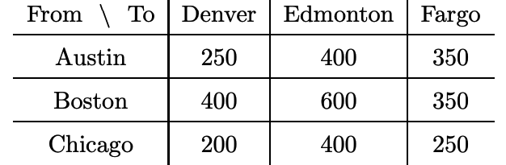

# Distributed Hungarian Method using Apache Spark 

### Introduction

[Hungarian Method](https://en.wikipedia.org/wiki/Hungarian_algorithm) is a Combinatorial Optimization In Operations Research, applied mathematics and theoretical 
computer science, combinatorial optimization is a topic that consists of finding an optimal object from a finite set of objects.

### Approach

This is NP Problem. 
I had 2 choices, either over Spark Dataframe or Graph(Bipartite), may be Spark [GraphX](https://spark.apache.org/docs/latest/graphx-programming-guide.html)
or any other distributed Pregel library.

Finally I decided to solve it  distributed way on top
of Spark Dataframe. GraphX is not that mature enough and implementing
any Max Flow algorithms like Ford Fulkerson on top of GraphX was bit tricky! 

### Example
You work as a sales manager for a toy
manufacturer, and you currently have three salespeople on
the road meeting buyers. Your salespeople are in Austin, TX;
Boston, MA; and Chicago, IL. You want them to fly to three
other cities: Denver, CO; Edmonton, Alberta; and Fargo,
ND. The table below shows the cost of airplane tickets in
dollars between these cities.

Where should you send each of your salespeople in order to
minimize airfare?

Some Matching related problem can be solved using Hungarian Method like
logistic assignment !

### Implementation

Code is based on Apache Spark(2.4) using Scala.
The entire logic is developed based on the following link -
http://www.math.harvard.edu/archive/20_spring_05/handouts/assignment_overheads.pdf

Use Spark Dataframe as core source for entire logic. All major steps
are distributed except 1 which is on top of driver.

The system is designed to iterate row/column scanning any number of times & that can be
provided by user _(default is 3)_.
**Diagonal Rule** is as well auto-applied when required.

For Graph oriented design, do refer [Bipartite Matching & the Hungarian Method](http://www.cse.ust.hk/~golin/COMP572/Notes/Matching.pdf)

#### Testing
sbt test

* Main Source of test MainRunnerTest
* Diagonal Rule Specific Test DiagonalProcessingTest
* Data Load, Col and Row Scanning Reduction Test in scanner package

For Docker please [refer](https://github.com/abhishek-ch/spark-docker)

#### Run

* Pass a parquet path to com.abc.hungarian.Main

## Notes

 * Please run the test cases to understand the codeflow better
 * To run with actual Dataframe, make sure to not provide any column
 name, currently column name mapping is not done, so entire code is
 based on default spark column name like _1 ... _N

 > TODO defect Column Name
 * Currently the code only reads/support parquet type, but adding
 new sources are very easy !
 * This is my _I am bored_ project, so not very well documented, will
 try to get them done.
 * Currently it supports Balanced Input and automatically balanced Column but not Row.
 > TODO defect no row-wise auto balance support
 * Column level zero crossing(marking row level) is based on Driver !
 > TODO defect scaleup column zero crossing
 
 
 
 ### References
 
 * A wonder explaination by [Kauserwise](https://www.youtube.com/watch?v=rrfFTdO2Z7I)
 * Bipartite [Graph](https://www.youtube.com/watch?v=JpapV5DrBek)
 * Bipartite [Matching]( https://www.youtube.com/watch?v=iAWSFmVh6hs)
 * Maximum Matching [problem](https://www.geeksforgeeks.org/maximum-bipartite-matching/)
 * Kőnig's [theorem](https://en.wikipedia.org/wiki/K%C5%91nig%27s_theorem_(graph_theory))
 
 

